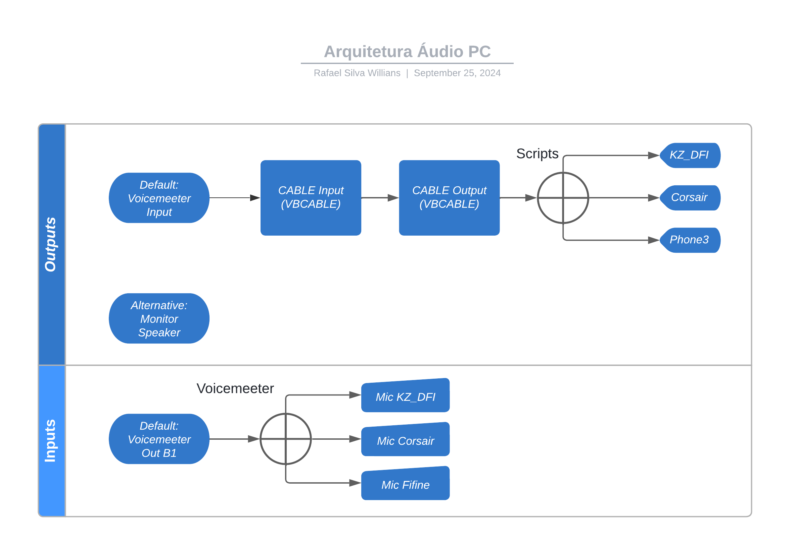

# Dolby Atmos Scripts

Scripts para alternar o Dolby Atmos entre dispositivos - apenas para Windows.

Dolby Atmos requer licença e apenas é possível atribuir a um único canal de áudio físico. Testado com Voicemeeter e infelizmente não foi possível atribuir a ele, somente ao dispositivo de saída físico.

Essa é uma configuração pessoal, pois pode não ser necessário ter o VBCABLE instalado.
Porém me agradou mais direcionar para ele, em vez de diretamente para a saída de áudio.
Caso utilizar sem VBCABLE, será necessário modificar o script.

## Requisitos

* Windows 10 ou superior
* Dolby Atmos (via Microsoft Store)
* SoundVolumeView
* Voicemeeter Banana
* VBCABLE

## Configurações no Voicemeeter
* Hardware Out: apenas CABLE Input (VBCABLE) e o CABLE Output direciona para a saída de áudio desejada com Dolby Atmos (KZ D-FI ou outro headset).

## Scripts - formato .BAT
### [Saída de Áudio Principal - KZ D-FI](./scripts/KZ-DFI.bat)

## Arquitetura do Áudio no PC

